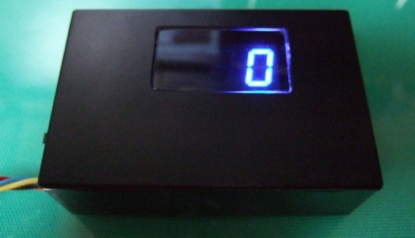
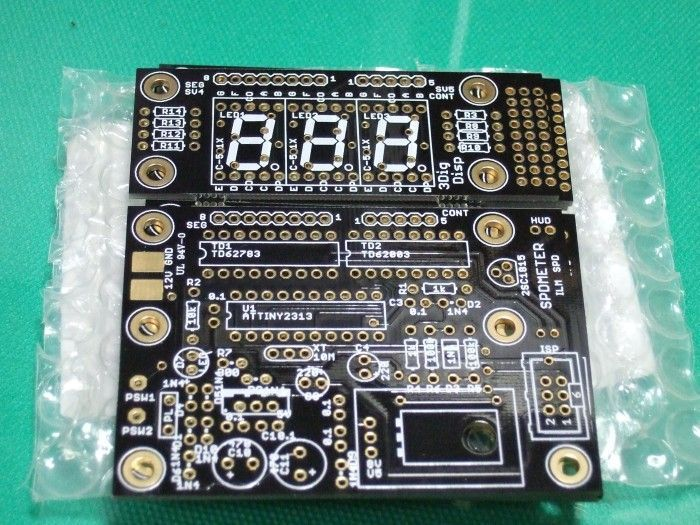
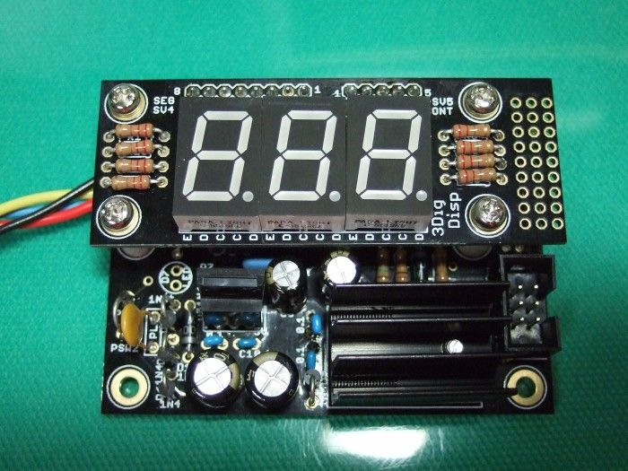
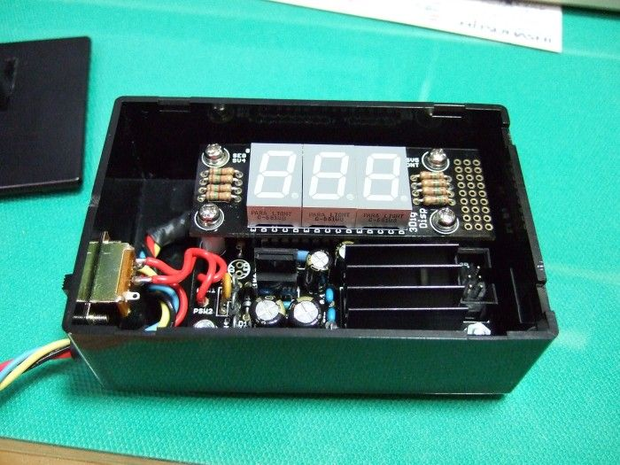

# avr-speedmeter
プログラマー5年目(2009年頃)のときの製作物です

## 概要
ATTiny2313を使ったデジタルスピードメーターで 
ヘッドアップディスプレイ(HUD)として使用も可能です。 
車速パルスを拾い、7セグLEDでスピード表示します。

## 動作環境
2009年当時の環境で開発
- ATTiny2313 10MHzで動作
- AVR Studio4
- WinAVR

## 背景
乗っていた車にHUDつけたいなと思ったのがきっかけで作りました。 
回路基板製作もやってみたかったので、Eagle（CAD）使って、 
回路図作り、最終的にはガーバーデータまで作成し、基板屋さんへ基板製作依頼しました。

## 使用方法
1. AVRマイコンにヒューズ設定.txtの内容を書き込んでください

1. main.hの設定を調整します
   | 設定項目 | 設定内容 |
   | --- | --- |
   | MISEC | define定義無しの場合、100us単位で調整可能、  define定義ありの場合1ms単位で設定可能 |
   | DISPLAY_CHG_TIME_HUD | HUDモードかつヘッドライトOFF時の7セグ1桁への出力時間 |
   | DISPLAY_OFF_TIME_HUD | HUDモードかつヘッドライトOFF時の7セグ1桁への出力OFF時間  出力時間のうちOFFする時間設定し減光させる |
   | DISPLAY_CHG_TIME_ILUM_HUD | HUDモードかつヘッドライトON時の7セグ1桁への出力時間 |
   | DISPLAY_OFF_TIME_ILUM_HUD | HUDモードかつヘッドライトON時の7セグ1桁への出力OFF時間  出力時間のうちOFFする時間設定し減光させる |
   | COUNTER_TIME | 車速パルスの測定周期かつ、スピード表示の更新周期 MES_COUNT x COUNTER_TIMEで1.4秒の値になるように設定する 1km/hが車速パルスで0.7Hzほどの周期のため |
   | ILUMI_TIME | イルミネーションON/OFFチェック周期 |
   | HUD_TIME | 起動時のHUDジャンパー確認までの待機時間 |
   | INITIAL_ON_TIME | 起動時の7セグ点灯チェックの点灯時間 |
   | INITIAL_OFF_TIME | 起動時の7セグ点灯チェック終了後の待機時間 |
   | MES_COUNT | 車速パルス測定回数、COUNTER_TIMEと合わせて設定 COUNTER_TIMEを伸ばすと、表示更新が遅くなるので、 MES_COUNTと組み合わせて更新間隔と測定時間を調整用 |
   | DISP_DIGIT | 固定値 3桁であることを設定（変更禁止） |
   | DISP_VALUE_NULL | 固定値 10とすることで7セグ非表示としてる（変更禁止） |

1. マイコンに書き込んで動作させてください

## 注意事項
- 本回路図は動作確認済みですが、製作・接続は自己責任で行ってください。

- 車など外部機器との接続により生じた破損や事故について、制作者は一切の責任を負いません。

## ライセンス
This software is released under the MIT License, see LICENSE.

## 作者
yseals

